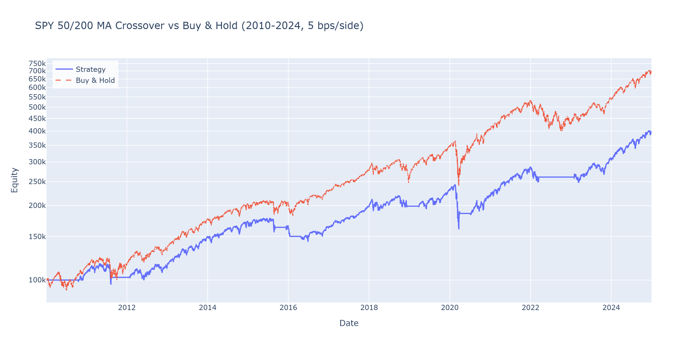

# ma-crossover-backtest


A from-scratch vectorised Python backtester for the moving-average crossover strategy on US-equity ETFs, with property-tested no-lookahead invariants, Newey-West HAC alpha, and Deflated Sharpe Ratio adjustment for data-snooping.

> **Headline (SPY, 2010-2024, 5 bps per-side cost):** SMA(50, 200) returns **9.5% CAGR** versus **13.7%** for buy-and-hold. The strategy's Jensen's alpha is +0.84% / year with **p = 0.69** under Newey-West HAC standard errors — we cannot reject the null of zero true skill. Max drawdown is **identical to B&H (-33.7%)**, contradicting the common claim that crossover rules reduce drawdowns. This is the project's honest, expected conclusion; see the references below for the academic consensus.

## Results at a glance

| Metric | Strategy SMA(50, 200) | Buy & Hold | Δ |
|---|---:|---:|---:|
| Total return | 289.4 % | 583.8 % | −294 pp |
| CAGR | 9.51 % | 13.70 % | −4.19 pp |
| Annualised volatility | 13.67 % | 17.05 % | −3.38 pp |
| Sharpe | 0.733 | 0.839 | −0.105 |
| Sortino | 1.007 | 1.175 | −0.168 |
| Maximum drawdown | −33.72 % | −33.72 % | ≈ 0 |
| Time spent invested | 64.2 % | 100 % | |
| Round trips per year | ≈ 0.5 | 0 | |

**Statistical comparison (HAC-adjusted regression, 3 773 daily obs, 8 NW lags):**

| Test | Value | Verdict |
|---|---:|---|
| Jensen's α (annual) | +0.84 % | t = 0.40, p = 0.69 — not distinguishable from 0 |
| β vs SPY | 0.64 | Strategy is in cash ~36 % of the time |
| Information ratio | −0.42 | Strategy *loses* per unit of active risk |
| Sharpe-difference (Memmel-JK) | −0.105 | p = 0.52 |


## Live demo

No hosted demo URL is committed to the repo — deploy your own in two clicks:

[](https://share.streamlit.io/deploy?repository=FatihHekim0glu/ma-crossover-backtest&branch=main&mainModule=streamlit_app.py)

The hosted version loads SPY 2010-2024 by default; use the sidebar to switch tickers (SPY, QQQ, IWM, GLD, TLT) and parameters.



## Why this is the right answer

This is not a strategy that works; it is a study in *how to evaluate one rigorously*.

A simple technical rule applied to a single, liquid, well-studied index after realistic transaction costs **should not** generate alpha. If it did, the more likely explanation would be a bug in the backtest than a market inefficiency. Bajgrowicz & Scaillet (2012) reach this exact conclusion on 7 846 technical rules over 1897-2011 after False Discovery Rate correction. The 1992 Brock-Lakonishok-LeBaron headline result is now understood as a combination of data-snooping over rule families and ignoring frictions; out-of-sample replications since 1990 are flat to negative net of costs.

The defensible *non*-claim is risk shape: the strategy spends ~36 % of the time in cash and runs lower volatility (13.7 % vs 17.1 %). That alone is not alpha — it is mechanical de-leveraging that gives up the equity risk premium for the privilege.

## What this repository actually demonstrates

1. **A vectorised engine with the `position = signal.shift(1)` discipline** enforced, not just documented. The no-lookahead invariant is property-tested via prefix-determinism (`tests/test_no_lookahead.py`): for any random truncation point `t` and any GBM-sampled price path, `backtest(prices[:t]).positions` must equal the first `t` elements of `backtest(prices).positions`. 40 Hypothesis examples on each of two independent properties (prefix-determinism + future-perturbation invariance).
2. **Realistic transaction-cost modelling** with sensitivity reporting at 0 / 5 / 10 / 20 bps per side (notebook 5). Trend rules degrade roughly linearly in cost.
3. **Walk-forward evaluation**: anchored 5-year train / 1-year out-of-sample / 1-year step. Selected parameters tie-broken by 8-neighbour plateau Sharpe rather than raw max, which Pardo, Aronson, and Bailey all recommend as the better robustness proxy.
4. **Multiple-testing correction**: Deflated Sharpe Ratio (Bailey & López de Prado, 2014) over the parameter grid, with effective trial count estimated via PCA on the strategy-return matrix (95 % variance threshold).
5. **HAC-corrected benchmark comparison**: CAPM regression with Newey-West standard errors at Andrews' 1991 bandwidth, plus Memmel-corrected Jobson-Korkie Sharpe-difference test. Without HAC the alpha p-value is artificially lower because residuals are autocorrelated for the entire holding period.
6. **Five-asset robustness check** on broad ETFs (SPY, QQQ, IWM, GLD, TLT) — picked specifically to avoid survivorship bias that a basket of "stocks still trading today" would silently introduce.

## What would be needed to turn this into a working strategy

1. **Cross-sectional universe** — many liquid futures (commodities, FX, rates, equity indices), not one equity ETF. Real trend-following CTAs (Man AHL, Aspect, Lynx) trade 20-400 markets.
2. **Volatility-targeted sizing** — scale exposure to a constant ex-ante volatility target so high-vol regimes don't dominate. Naïve unit-leverage on a 2008-style year dominates risk.
3. **Multi-horizon ensemble** — blend e.g. (20, 100), (60, 200), (120, 252) rather than committing to a single (fast, slow) pair. Reduces parameter risk and smooths turnover.
4. **Regime filter** — only trade trend signals when realised volatility is in a trend-friendly band; sit out high-chop periods.

Hurst, Ooi & Pedersen (2017) document positive trend-following returns over 1880-2016 across 67 markets — but with equity indices being the *weakest* contributor. The literature is consistent: single-equity-index MA crossover is the hard case.

## Reproduce in 60 seconds

```bash
git clone <repo-url>
cd ma-crossover-backtest
uv sync --all-extras --dev

# Headline result
uv run ma-backtester run --ticker SPY --fast 50 --slow 200 --start 2010-01-01 --end 2024-12-31

# In-sample parameter sweep + DSR
uv run ma-backtester sweep --ticker SPY --start 2010-01-01 --end 2024-12-31

# Honest walk-forward
uv run ma-backtester walk-forward --ticker SPY --start 2005-01-01 --end 2024-12-31

# Run the notebooks
uv run jupyter lab notebooks/

# Test suite + type check
uv run pytest -q              # KIKO + property-based; offline
uv run pyright src tests      # standard mode, 0 errors
uv run ruff check . && uv run ruff format --check .
```

## Repo layout

```
src/ma_backtester/
  config.py          frozen dataclasses for strategy/cost/walk-forward
  results.py         BacktestResult, MetricsTable, BenchmarkComparison, WalkForwardResult
  data.py            yfinance loader with parquet cache and validation
  strategy.py        signal generation (SMA crossover), shift discipline
  costs.py           per-side bps cost model
  backtester.py      vectorised engine, trade extraction
  metrics.py         Sharpe / Sortino / Calmar / drawdown / trade stats
  benchmark.py       CAPM with HAC SEs, IR, Memmel-JK Sharpe-diff
  walk_forward.py    anchored expanding folds with neighbourhood tie-break
  data_snooping.py   Deflated Sharpe Ratio, PCA-based N_effective
  plotting.py        plotly figures (Scattergl, log-scale equity, heatmap)
  cli.py             Typer CLI: run / sweep / walk-forward
tests/               KIKO + Hypothesis property-based tests
notebooks/           01 basic backtest -> 05 final report
```

## Limitations

- **Daily bars only.** Intraday execution detail (limit orders, slippage modelling at the bid-ask) is out of scope.
- **Long-only.** No short selling, no leverage. Adds borrow/margin complexity and is not the literature's setup.
- **Single asset at a time.** The walk-forward / DSR machinery is per-ticker, not portfolio-level. A multi-asset version would also need correlation-aware position sizing.
- **No regime detection / vol targeting.** Both improve trend strategies materially; the goal here is to evaluate the plain rule honestly, not to optimise it.
- **yfinance dependence.** A live-data project would use Polygon / Tiingo / Refinitiv. Notebook 4 cross-validates one ticker against Stooq.

## References

- Brock, W., Lakonishok, J., & LeBaron, B. (1992). Simple Technical Trading Rules and the Stochastic Properties of Stock Returns. *Journal of Finance*, 47(5), 1731-1764.
- Sullivan, R., Timmermann, A., & White, H. (1999). Data-Snooping, Technical Trading Rule Performance, and the Bootstrap. *Journal of Finance*, 54(5), 1647-1691.
- Lo, A. W., Mamaysky, H., & Wang, J. (2000). Foundations of Technical Analysis. *Journal of Finance*, 55(4), 1705-1765.
- Bajgrowicz, P., & Scaillet, O. (2012). Technical trading revisited: False discoveries, persistence tests, and transaction costs. *Journal of Financial Economics*, 106(3), 473-491.
- Bailey, D. H., & López de Prado, M. (2014). The Deflated Sharpe Ratio. *Journal of Portfolio Management*, 40(5), 94-107.
- Hurst, B., Ooi, Y. H., & Pedersen, L. H. (2017). A Century of Evidence on Trend-Following Investing. *Journal of Portfolio Management*, 44(1), 15-29.
- Newey, W., & West, K. (1987). A Simple, Positive Semi-Definite, Heteroskedasticity and Autocorrelation Consistent Covariance Matrix. *Econometrica*, 55(3), 703-708.
- Andrews, D. W. K. (1991). Heteroskedasticity and Autocorrelation Consistent Covariance Matrix Estimation. *Econometrica*, 59(3), 817-858.

## Deploying to Streamlit Cloud

1. Fork this repository.
2. Sign in at [share.streamlit.io](https://share.streamlit.io).
3. Click "New app".
4. Select your fork and `streamlit_app.py` as the entry point.
5. Deploy.

`requirements.txt` is auto-generated from `uv.lock`; regenerate it with:

```bash
uv export --format requirements-txt --no-dev --no-emit-project --extra app --output-file requirements.txt
```

`--extra app` includes `streamlit` (which lives under `[project.optional-dependencies].app` in `pyproject.toml`).

A secrets template is provided in `.streamlit/secrets.toml.example`.

## License

MIT.
